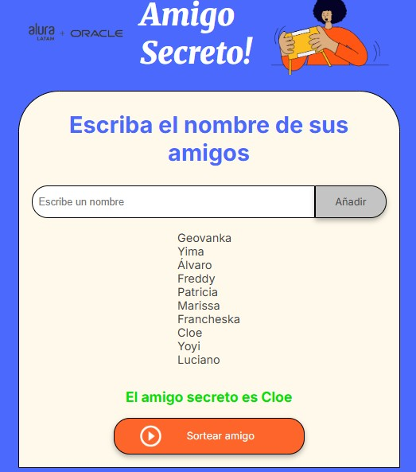

# Challenge del Amigo Secreto! :raising_hand: 

_El objetivo principal de este desafío es desarrollar habilidades en lógica de programación, construir la lógica del código JavaScript, aplicando conceptos clave como funciones, arrays, condicionales y variables. Esto te permitirá centrarte en resolver el problema y mejorar el razonamiento lógico._

---

## Comenzando 🚀

_Estas instrucciones te permitirán obtener una copia del proyecto en funcionamiento en tu máquina local para propósitos de desarrollo, práctica o personalización._

### Instalación 🔧

_1. Clona este repositorio o descárgalo como archivo '.zip':_

_git clone_

```
https://github.com/Geovanka16/challenge-amigo-secreto.git
```

_2. Abre la carpeta en tu editor de código_

_3. Inicia el proyecto abriendo el archivo 'index.html' en el navegar (o puedes usar lve server)_

---

## Ejecutando la aplicación ⚙️

_Ingresa los nombres_
_Haz click en **"Añadir"**_
_Cuando estén todos tus amigos en lista, usa **"Sortear amigo"** para obtener un resultado aleatorio_

<p align="center">
  
</p>

---

### Características ⌨️

_:white_check_mark:Ingreso de nombres_

_:white_check_mark:Almacenamiento en arrar JavaScript_

_:white_check_mark:Actualización dinámica del listado en HTML_

_:white_check_mark:Sorteo aleatorio con 'Math.random()' y 'Math.floor()'_

_:white_check_mark:Interfaz clara_

_:white_check_mark:Agregado de imagen/logo en el banner_

---

## Construido con 🛠️

* HTML
* CSS
* JavaScript
* VS Code
  
---

## Contribuyendo 🖇️

Este es un proyecto de práctica, ya que soy estudiante de Oracle Next Education + Alura Latam. Si desean aportar con sugerencias para mejorar u opiniones constructivas, son todos bienvenidos/as.

---

## Autores ✒️

* **Oracle Next Education + Alura Latam** - *HTML y CSS* - [One+AluraLatam]
* **Geovanka Cuero Bacilio** - *JavaScript* - [Geovanka](https://github.com/Geovanka16)

---

## Agradecimiento 🎁

* Gracias a AluraLatam + ONE por la oportunidad de aprender y crear. 📢
* A quienes puedan apoyar con ideas, sugerencias, feedback etc. 

---

⌨️ con :gift_heart: por [Geovanka](https://github.com/Geovanka16) :alien:
